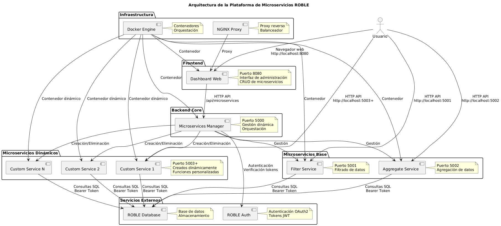
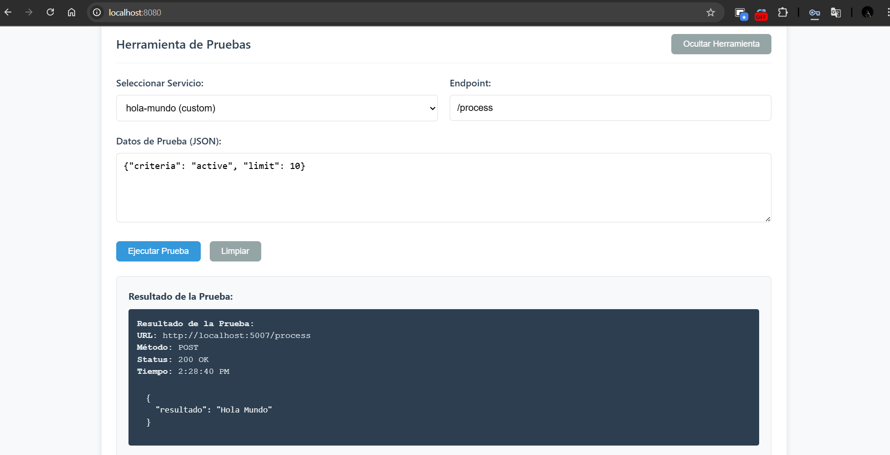
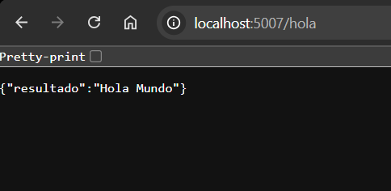
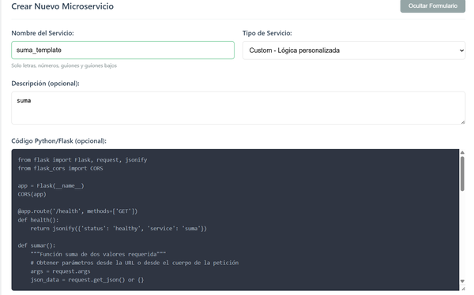
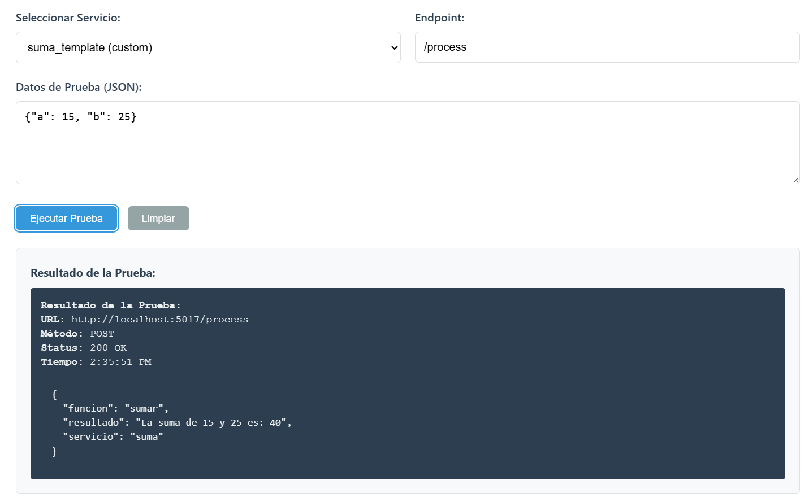
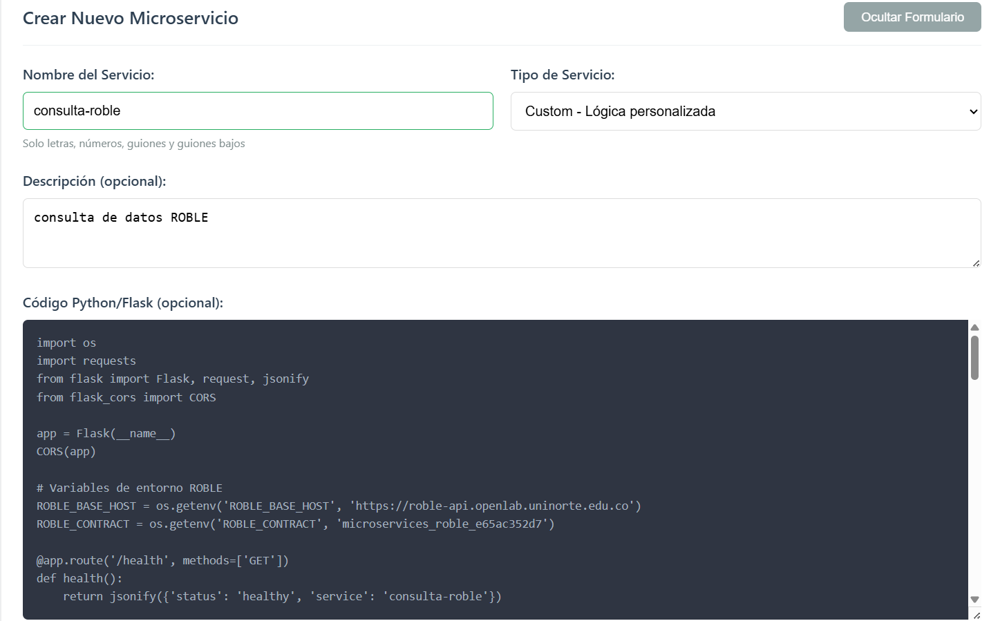
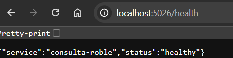
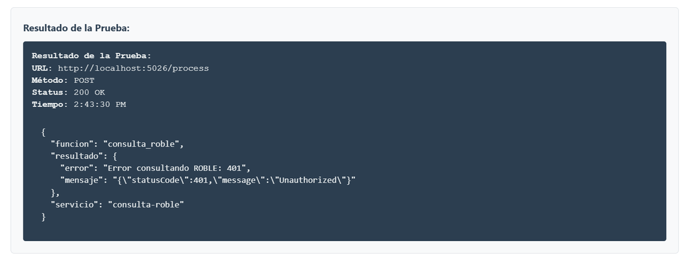

# Microservicios ROBLE Platform

Una plataforma completa de microservicios integrada con ROBLE (Sistema de autenticación de Universidad del Norte) que permite crear, gestionar y probar microservicios dinámicos utilizando Docker y Flask.

##  Descripción

Esta plataforma proporciona un sistema de gestión de microservicios con las siguientes capacidades:

- **Autenticación integrada** con el sistema ROBLE de la Universidad del Norte
- **Creación dinámica** de microservicios usando Docker
- **Dashboard web** para gestión visual de microservicios
- **Microservicios base** para filtrado y agregación de datos
- **Sistema de permisos** basado en roles de usuario
- **Herramientas de prueba** integradas para validar microservicios

##  Arquitectura
#### Diagrama de Arquitectura



### Componentes Principales

#### 1. Manager (`manager/`)
- **Propósito**: API central para gestión de microservicios
- **Puerto**: 5000
- **Funcionalidades**:
  - Autenticación con ROBLE
  - Creación y eliminación de microservicios dinámicos
  - Gestión de contenedores Docker
  - API REST para operaciones CRUD
  - Sistema de limpieza automática de contenedores

#### 2. Dashboard (`dashboard/`)
- **Propósito**: Interfaz web
- **Puerto**: 8080
- **Funcionalidades**:
  - Login con credenciales ROBLE
  - Creación de microservicios con código personalizado
  - Monitoreo de servicios activos
  - Herramientas de prueba integradas
  - Exportación de configuraciones

#### 3. Microservicios Base (`microservices/`)

##### Filter Service
- **Puerto**: 5001
- **Función**: Filtrado de usuarios desde ROBLE
- **Endpoints**: `/filter`, `/health`

##### Aggregate Service  
- **Puerto**: 5002
- **Función**: Agregación y estadísticas de datos ROBLE
- **Endpoints**: `/aggregate`, `/health`

##  Instalación y Configuración

### Prerrequisitos

- Docker y Docker Compose
- Acceso a internet para conectar con ROBLE API
- Credenciales válidas del sistema ROBLE

### Variables de Entorno

Crear archivo `.env` con:

```env
ROBLE_BASE_HOST=https://roble-api.openlab.uninorte.edu.co
ROBLE_CONTRACT=TU_CONTRATO_ROBLE_AQUI
```

### Inicio del Sistema

```bash
# Iniciar todos los servicios
docker-compose up
```

```bash
# Iniciar servicios
docker-compose up -d

# Verificar estado
docker-compose ps

# Ver logs
docker-compose logs -f
```

## -- Uso de la Plataforma --

### Acceso al Dashboard

1. Navegar a `http://localhost:8080`
2. Iniciar sesión con credenciales ROBLE
3. Acceder al panel principal

### Creación de Microservicios

#### Desde Dashboard:
1. **Mostrar Formulario** de creación
2. **Configurar parámetros**:
   - Nombre del servicio
   - Tipo (filter/aggregate/custom)
   - Descripción opcional
   - Código Python/Flask personalizado
3. **Crear Microservicio**

#### Tipos de Microservicios:
- **Filter**: Para filtrado de datos
- **Aggregate**: Para agregación y estadísticas  
- **Custom**: Código personalizado definido por usuario

### Gestión de Microservicios

#### Operaciones Disponibles:
- **Listar**: Ver todos los microservicios activos
- **Crear**: Nuevos microservicios dinámicos
- **Eliminar**: Servicios no estáticos
- **Probar**: Endpoints con herramienta integrada
- **Monitorear**: Estado y estadísticas

#### Puertos Dinámicos:
- Los microservicios creados dinámicamente reciben puertos automáticamente
- Rango de puertos: 5003 en adelante
- Gestión automática de conflictos

### Herramientas de Prueba

#### Herramienta Integrada:
1. **Seleccionar servicio** de la lista
2. **Configurar endpoint** (automático según tipo)
3. **Proporcionar datos JSON** de prueba
4. **Ejecutar prueba** y ver resultados

#### Endpoints Estándar:
- `/health` - Estado del servicio
- `/process` - Endpoint genérico de procesamiento
- Endpoints específicos según tipo de servicio

##  API del Manager

### Autenticación

#### POST `/api/login`
- **Función**: Autenticación con ROBLE
- **Requiere**: email, password
- **Retorna**: token de sesión

### Gestión de Microservicios

#### GET `/api/microservices`
- **Función**: Listar microservicios activos
- **Retorna**: Lista completa con estado y configuración

#### POST `/api/microservices`
- **Función**: Crear nuevo microservicio
- **Requiere**: 
  - Autenticación válida
  - Permisos de creación
  - Parámetros: name, type, config, custom_code (opcional)

#### DELETE `/api/microservices/<service_id>`
- **Función**: Eliminar microservicio dinámico
- **Requiere**: 
  - Autenticación válida
  - Permisos de eliminación
- **Restricción**: No elimina servicios estáticos

### Utilidades

#### GET `/api/status`
- **Función**: Estado del manager
- **Retorna**: Información del sistema

#### POST `/api/cleanup`
- **Función**: Limpieza manual de contenedores
- **Retorna**: Reporte de limpieza

##  Sistema de Permisos

### Roles de Usuario:
- **Admin**: Acceso completo (crear, eliminar, gestionar)
- **User**: Acceso limitado (solo lectura y uso)

### Verificación de Permisos:
- Basado en token ROBLE válido
- Verificación de rol en cada operación
- Permisos específicos por acción (create, delete, read)

##  Sistema de Limpieza

### Limpieza Automática:
- **Al inicio**: Elimina contenedores dinámicos previos
- **Servicio cleanup**: Se ejecuta antes de otros servicios
- **Prevención**: Evita conflictos de puertos y nombres

### Limpieza Manual:
- Endpoint `/api/cleanup` en el manager
- Elimina contenedores e imágenes dinámicas
- Mantiene servicios base intactos

## 🐳 Configuración Docker

### Redes:
- Red bridge personalizada: `microservices_network`
- Comunicación interna entre servicios
- Acceso externo por puertos mapeados

### Volúmenes:
- Socket Docker montado para gestión de contenedores
- Persistencia de logs y configuraciones

### Dependencias:
- Orden de inicio controlado
- Cleanup → Manager → Dashboard → Servicios base

##  Monitoreo y Estadísticas

### Dashboard Incluye:
- **Contador de servicios** totales, activos y creados
- **Estado en tiempo real** de cada microservicio
- **Auto-refresh** configurable
- **Logs del sistema** accesibles
- **Estadísticas detalladas** exportables

### Logs:
- Centralizados por servicio
- Formato estructurado con timestamps
- Niveles: INFO, WARNING, ERROR
- Accesibles vía Docker logs

##  Desarrollo y Extensión

### Estructura de Código:
- **Modular**: Cada componente independiente
- **Configurable**: Variables de entorno
- **Extensible**: Fácil adición de nuevos tipos de microservicios
- **Documentado**: Código comentado y estructurado

### Integración ROBLE:
- API calls a endpoints oficiales
- Manejo de tokens y autenticación
- Verificación de permisos en tiempo real
- Acceso a bases de datos del contrato

##  Rendimiento y Escalabilidad

### Optimizaciones:
- **Contenedores ligeros** con Python slim
- **Limpieza automática** de recursos no utilizados
- **Puertos dinámicos** para evitar conflictos
- **Red interna** para comunicación eficiente

### Limitaciones:
- Recursos limitados por host Docker
- Puertos disponibles en rango definido
- Dependencia de conectividad con ROBLE API

# ---- PRUEBAS ----

## Prueba 1 (Hola Mundo)

- Crear Microservicio:
- Haz clic en "Mostrar Formulario"
- Tipo: Custom
- Nombre: hola-mundo (o suma, o consulta-roble)



- Copia el código de la carpeta de templates: hola_mundo_template.py

- Prueba de la invocación del microservicio



## Prueba 2 (suma)

- Crear Nuevo Microservicio:
- Haz clic en "Mostrar Formulario"
- Nombre: suma
- Tipo: Custom
- Descripción: Microservicio que suma dos números



- Copiar y pegar el código que está en la carpeta de templates: suma_template.py

- ejemplo json:
```bash
{"a": 30, "b": 70}
```

- Respuesta esperada:
```bash
{
  "resultado": "La suma de 30 y 70 es: 100",
  "funcion": "sumar", 
  "servicio": "suma"
}
```

- Prueba del microservicio:


- Método diferente: Con Parámetros en URL
"http://localhost:PUERTO/sumar?a=10&b=20"

## Prueba 3 (consultar tabla Roble)

- Crear Nuevo Microservicio:
- Haz clic en "Mostrar Formulario"
- Nombre: consulta-roble
- Tipo: Custom
- Descripción: Consulta datos de ROBLE



- Código: Copia todo el codigo que está en la carpeta de templates: consulta_roble_template.py

- Pruebas en el dashboard, busca la sección "Herramienta de Pruebas"
- Haz clic en "Mostrar Herramienta"

- Prueba de la invocación del microservicio



#### PRUEBA DE ERRORES


#### CONSULTA ROBLE
 - NOTA: Esta función requiere POST con JSON, NO funciona directamente en navegador

### Verificar que los servicios funcionan
http://localhost:PUERTO/health

### Hola Mundo:
- GET /health - Estado del servicio
- GET /hola - Función principal
- POST /process - Endpoint genérico
### Suma:
- GET /health - Estado del servicio
- GET /sumar?a=X&b=Y - Suma con parámetros URL
- POST /sumar - Suma con JSON
- POST /process - Endpoint genérico
### Consulta ROBLE:
- GET /health - Estado del servicio
- POST /consulta - Función principal (requiere JSON)
- POST /process - Endpoint genérico (requiere JSON)